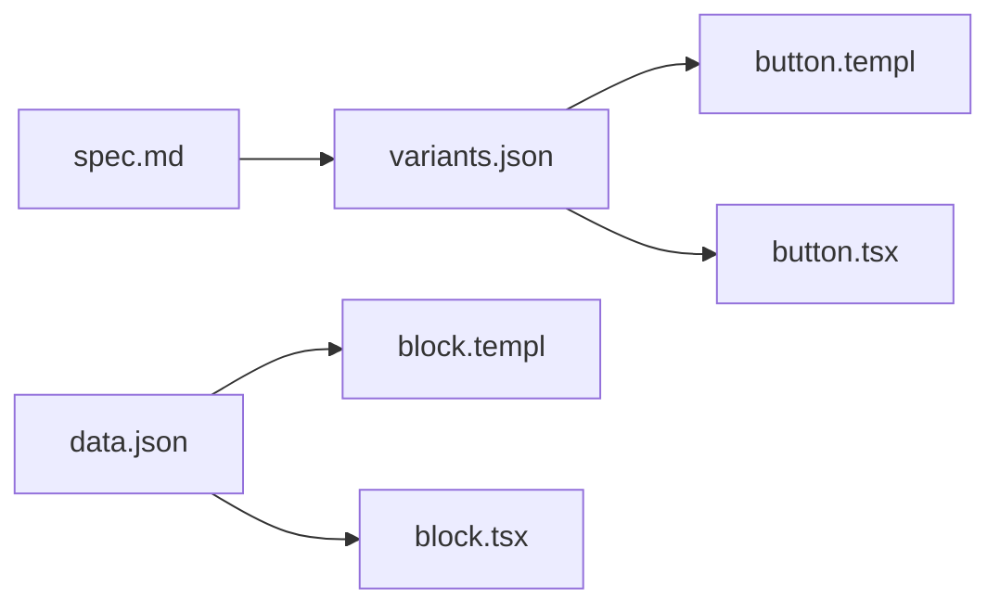

# Mental Model

Five ideas that explain how the registry stays consistent across Go Templ SSR
and React TSX. Read this before diving into individual bricks or
`.cursor/rules`.

## 1. Recipe JSON is the source

Every brick has a colocated `*.variants.json` file. That JSON is the single
source of truth for Tailwind class composition.

- **React** — `composeRecipe()` in `utils/recipes.ts` reads the same JSON.
- **Go Templ** — `uiutils.Compose()` reads the same JSON (often via generated
  `*_variants.go`).

When you change a variant, update the JSON once. Both runtimes pick up the same
classes. Do not duplicate variant maps in `.templ` or `.tsx` files.

## 2. Spec-driven parts

Every brick also has a `*.spec.md` file. It declares:

- **parts** — named sub-components (`CardHeader`, `FormItem`, …)
- **api** — props, roles, and allow-lists
- **slots** — what children each part accepts
- **showcase** — fixture references for examples and tests

Validators (`validate-spec`, `variantcheck`, `blockonce`) enforce that
implementations match the spec. The spec is the contract; the code is the port.

## 3. Layout grammar

Bricks and example blocks follow a strict layout hierarchy:

| Primitive | Role | Typical tag |
|-----------|------|-------------|
| `Block` | Starts a file/block exactly once; landmark or root widget | `main`, `aside`, `header`, `section`, `div` |
| `Box` | Inner non-landmark container | `div` only |
| `Stack` | Vertical flow | `div` |
| `Group` | Horizontal grouping (or `fieldset` for forms) | `div` or `fieldset` |

Raw HTML container tags (`
`, `<aside>`, `<header>`) are forbidden inside
registry bricks and example scaffolds. Use primitives instead.

`Block` may default to `
` when the widget is not a document landmark.
`Box` always resolves to `
` — never pass landmark tags to `Box`.

## 4. ui8kit is the only reactivity boundary

Registry bricks are **static**. They render HTML and ARIA attributes; they do
not ship client-side state machines.

Interactive patterns (Sheet, Dialog, Accordion, …) opt in to
[`@ui8kit/aria`](aria.md) via `data-ui8kit` attributes and a small
`manifest.json` per application. No custom JavaScript inside bricks.

If you need open/close behavior, use the documented Sheet pattern with
`behavior="ui8kit"` — not `useState` inside a brick file.

## 5. Two runtimes, one contract

The same design contract powers both stacks:

- **Templ** — server-rendered HTML for SSR consumers and the Go module.
- **React** — client-rendered components for SPA consumers and the Vite example.

Ports live side by side (`ui/button/button.templ` next to `button.tsx`).
Differences between stacks are documented in [`learn/`](learn/) and
[`coming-from-shadcn.md`](coming-from-shadcn.md), not hidden in comments.

When you add a brick, add both ports, both spec files, and a `_test.tsx` if
the spec requires it.

## Where to go next

- [`coming-from-shadcn.md`](coming-from-shadcn.md) — shadcn habits mapped to
  registry rules.
- [`learn/01-hero/`](learn/01-hero/) — first split-view lesson (Hero block).
- [`architecture.md`](architecture.md) — deeper dual-stack contract details.
- [`aria.md`](aria.md) — Sheet, Dialog, and ui8kit behavior hooks.
